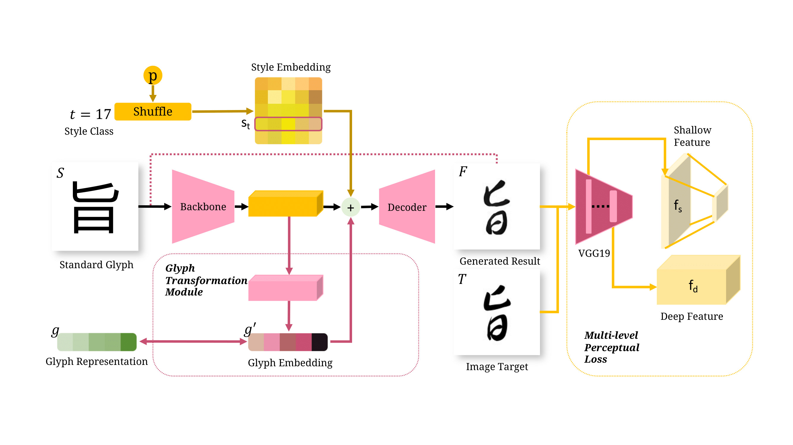
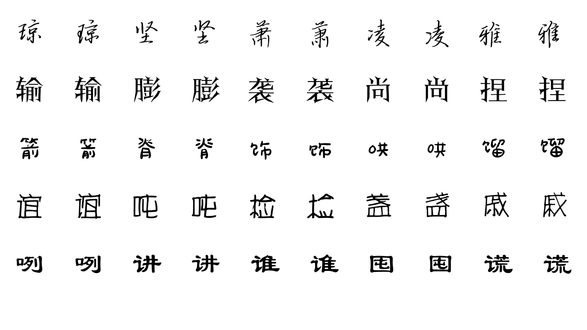

# FSGlyphST
ESTR4999 Final Year Project: Few-Shot Chinese Glyph Stylization

[Report is here](misc/ESTR4999_Report.pdf)

The brief inference procedure of our method. a). Given an input image with a pre-defined standard font, a glyph embedding could be extracted, containing Chinese glyph components of the given image. Meanwhile, a target style embedding is selected. Both glyph and style embedding are feed into a decoder to generate a target stylized glyph. b). The training set is combined by a support font set and a few shot font set, each few shot font only contains 175 training samples.

The overview of our method. With the input of a standard glyph image ***S*** and its style class ***t***, a fake result ***F*** is generated by a decoder to process on the concatenation of style and glyph embedding. Meanwhile, the generated result will pass the backbone (denoted as the pink dash line) to keep consistency of the glyph representation. The distance evaluation between ***F*** and the target image ***T*** is done by the multi-level perceptual loss module, in which, a VGG network is used as a feature extractor to get multi-stage feature representations.

More results of our method. Each row represents a style with few-shot training examples. In each pair of images, left is the generated glyph, as the right one is the testing ground truth.
